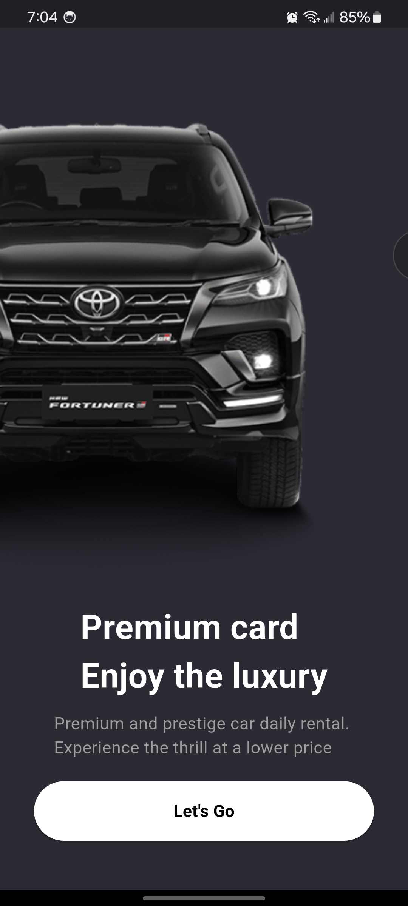
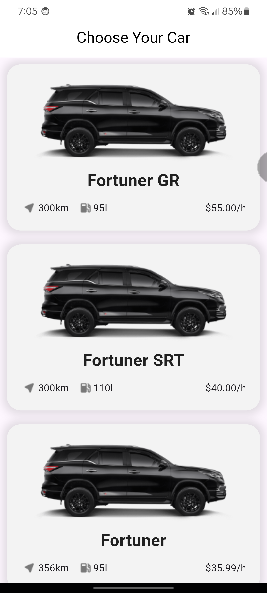
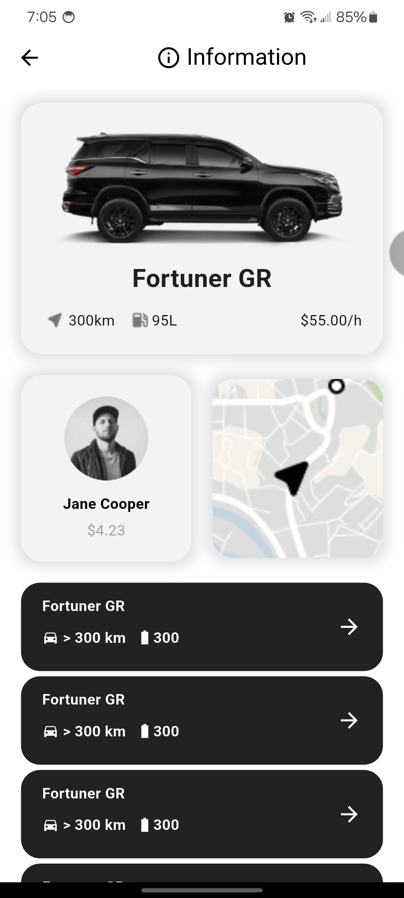
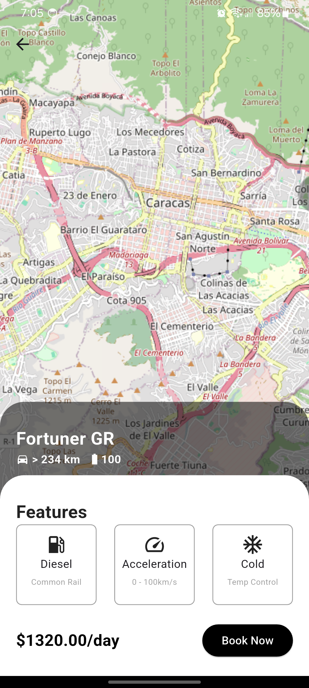

# Car Rental App

This is a practical application. Here, an app for renting cars is developed using Clean Architecture, Firebase, and state management with BloC.

You need create a Firestore and connect.

## ✅ Features
- Onboarding
- Clean Architecture
- Connect to firestore
- Show maps (Flutter Maps y OpenStreetMap)

## ⚙️ Tech Stack
- flutter 3.7 
- firebase_core: ^4.11.0
- cloud_firestore: ^6.6.0
- flutter_map: ^8.3.1
- latlong2: ^0.10.1
- bloc: ^9.2.1
- flutter_bloc: ^9.1.1
- get_it: ^9.2.1
- flutter_dotenv: ^6.0.1


## 💾 Installation

Install and run

1. Clone and move to folder
```bash
$ git clone git@github.com:abrahamuchos/car-rental-app
$ cd car-rental-app
```

2. Install dependencies
```bash
$  flutter pub get
```

3. Config environment file 

```dotenv
FIREBASE_API_KEY =
FIREBASE_APP_ID =
FIREBASE_MESSAGING_SENDER_ID =
FIREBASE_PROJECT_ID =
FIREBASE_STORAGE_BUCKET =
```

4. Run dev `flutter run`

If you encounter issues, run `flutter doctor` to check for missing dependencies or configuration errors.


## 📄 Docs

_This is based on FlutterGuys' practices. Here are their repositories_:<br>
[Repository - GitHub/Fabrice-Fabi](https://github.com/Fabrice-Fabio/rentapp)<br>
[Build Car Rental App - Flutter, Firebase, Bloc, Clean Architecture, Google Map – Youtube](https://www.youtube.com/watch?v=RKrWgdCUP1U)


## 📷 Screenshot






## 🧑‍💻 Authors
- [Portfolio - Abrahamuchos](https://abrahamuchos.onrender.com/)
- [@abrahamuchos](https://github.com/abrahamuchos)
- [Contact mail](mailto:abrahmuchos@gmail.com)
